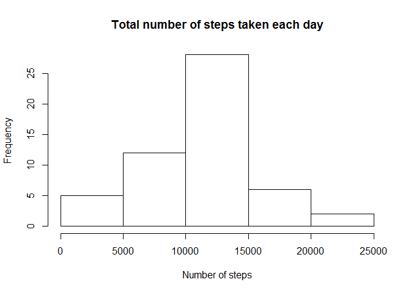
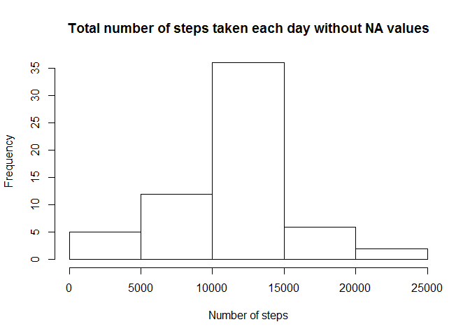
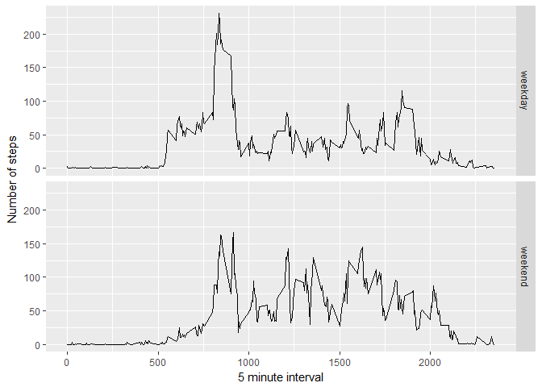

# Reproducible Research: Peer Assessment 1


We'll use ggplot2 in this assignment, so make sure it is installed and available and can be loaded via:

```r
library(ggplot2)
```

## Loading and preprocessing the data
We first load the data via the `read.csv` function. It is assummed that the `activity.csv` file, which contains the data, has been made available.


```r
data = read.csv("activity.csv")
```

## What is mean total number of steps taken per day?
We now want to find out what the mean total number of steps per day is. We can calculate this number via:


```r
totalStepsPerDay = aggregate(steps ~ date, data, sum, na.rm = TRUE)
```

Let's create a histogram of this data:


```r
hist(
  totalStepsPerDay$steps,
  main = "Total number of steps taken each day",
  xlab = "Number of steps"
)
```

<!-- -->

We see that the bin with 10000 - 15000 steps per day occurs most often. Let's also find out about the mean and median steps per day:


```r
mean(totalStepsPerDay$steps)
```

```
## [1] 10766.19
```

```r
median(totalStepsPerDay$steps)
```

```
## [1] 10765
```

## What is the average daily activity pattern?
Next, we want to find out what the average daily activity pattern looks like. We can calculate the average number of steps taken on a 5 minute interval base:


```r
avgStepsPerInterval = aggregate(steps ~ interval, data, mean, na.rm = TRUE)
```

Let's make a time-series plot based on this data:


```r
plot(steps ~ interval, data = avgStepsPerInterval, type = "l")
```

<!-- -->

The 5 minute interval with the most steps on average can be found out with: 


```r
avgStepsPerInterval[which.max(avgStepsPerInterval$steps), "interval"]
```

```
## [1] 835
```

## Imputing missing values
For the next part we want to find out about how many rows in the dataset have missing steps values. This is rather easy to do by `sum`ming up row where the steps variable is `NA`.


```r
sum(is.na(data$steps))
```

```
## [1] 2304
```

Because `NA`s could bias the calculations we are about to perform, we first need to get rid of these data values. We first define a function `replaceNA` that, given the value of steps and a interval, either just returns the steps in case it does not contain a `NA` or replaces the `NA` with the corresponding value from dataset containing the average steps per interval across all days. This is how our function looks like:


```r
replaceNA <- function(steps, ival) {
  if (is.na(steps))
    return (subset(avgStepsPerInterval, interval == ival)$steps)
  else
    return (steps)
       
}
```

We create the new data set by applying this function across the data:


```r
normalizedData = data
normalizedData$steps = with(normalizedData, mapply(replaceNA, steps, interval))
```

Finally, let's create a histogram of this normalized data:


```r
normalizedTotalStepsPerDay = aggregate(steps ~ date, data = normalizedData, sum)
hist(
  normalizedTotalStepsPerDay$steps, 
  main = "Total number of steps taken each day without NA values",
  xlab = "Number of steps"
)
```

<!-- -->

As we can see the missing values had an impact on the frequency of the most occurring bin (10000 - 15000 steps) as it slightly increased to around 35.

The mean and median of the normalized data are:


```r
mean(normalizedTotalStepsPerDay$steps)
```

```
## [1] 10766.19
```

```r
median(normalizedTotalStepsPerDay$steps)
```

```
## [1] 10766.19
```
The mean stay the same, but the median changed sligthly.

## Are there differences in activity patterns between weekdays and weekends?

In this last part of the assignment, we want to find out whether activity patterns differ based on what days the activity takes place. We'll create a factor variable with two levels, 'weekday' and 'weekend'. Hence, we first need to classify the different weekdays. We can do with the following function:


```r
toWeekday = function(day) {
  if (day == 'Saturday' || day == 'Sunday') {
    return ('weekend')
  }
  return ('weekday')
}
normalizedData$weekday = sapply(weekdays(as.Date(normalizedData$date)), toWeekday)
```

Let's create plots to find out how the activity differs based on the factor variable:


```r
avgStepsPerIntervalAndDay <- aggregate(steps ~ interval + weekday, data = normalizedData, mean)
ggplot(avgStepsPerIntervalAndDay, aes(interval, steps)) + 
    geom_line() + 
    facet_grid(weekday ~ .) +
    xlab("5 minute interval") + 
    ylab("Number of steps")
```

<!-- -->
    
It seems as if on weekdays the activity in intervals 750 - 1000 is higher than on weekends, but througout the whole day the activity on weekends tends to be higher.
